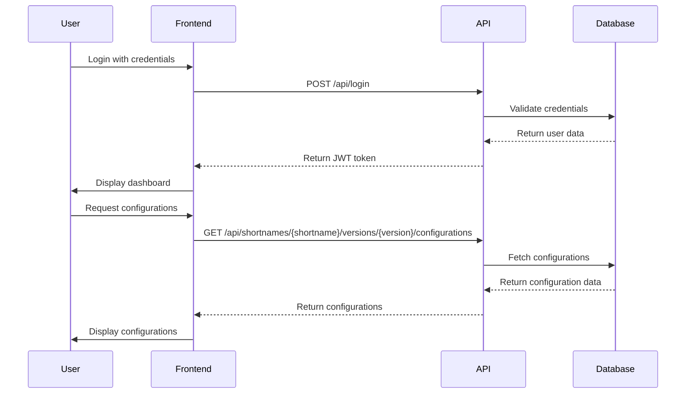
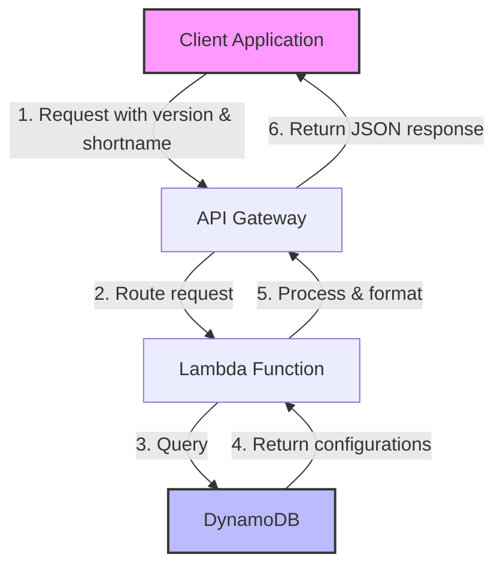
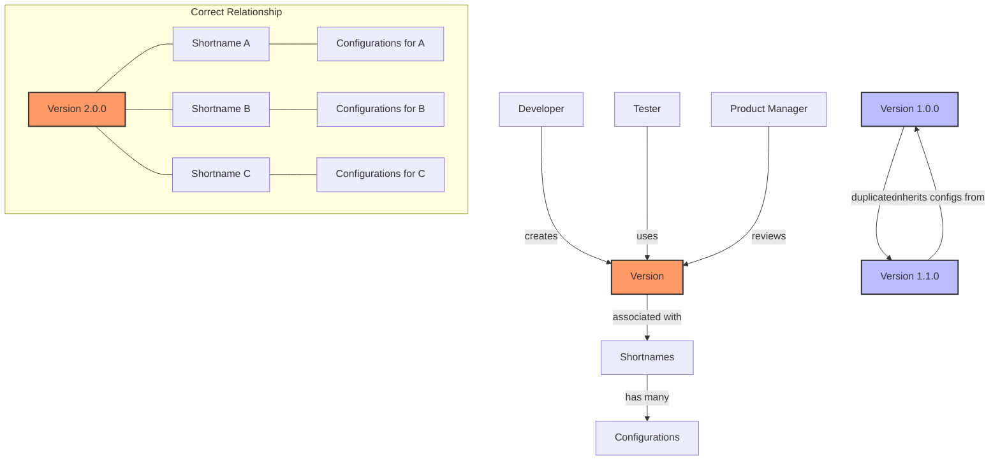
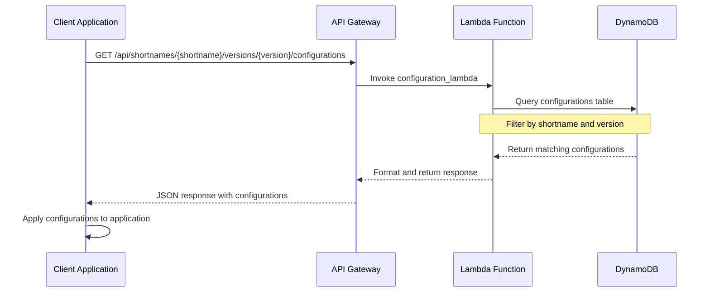
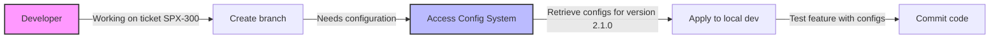
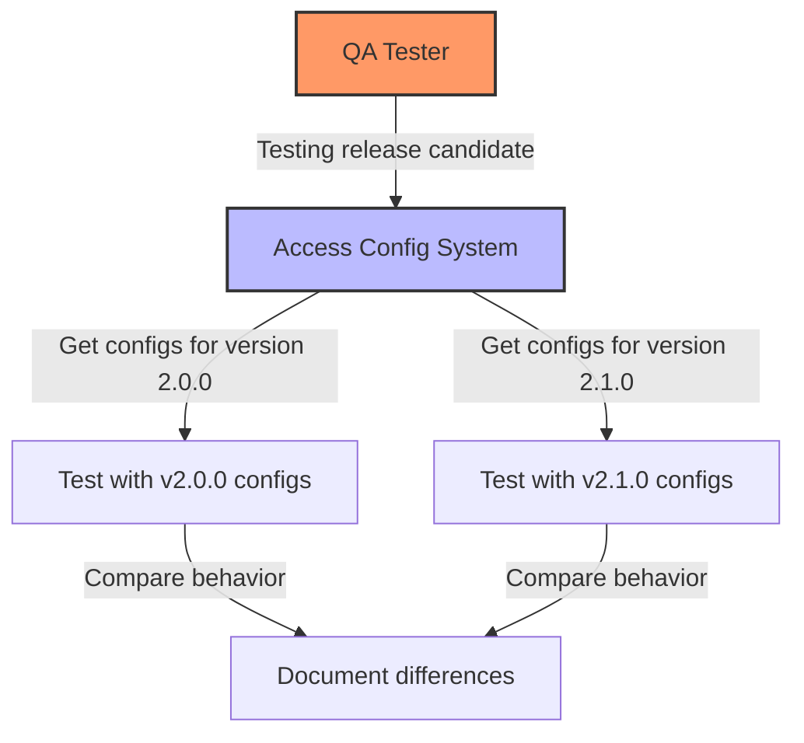
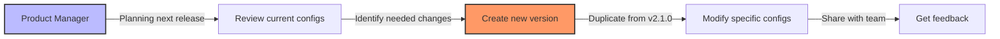
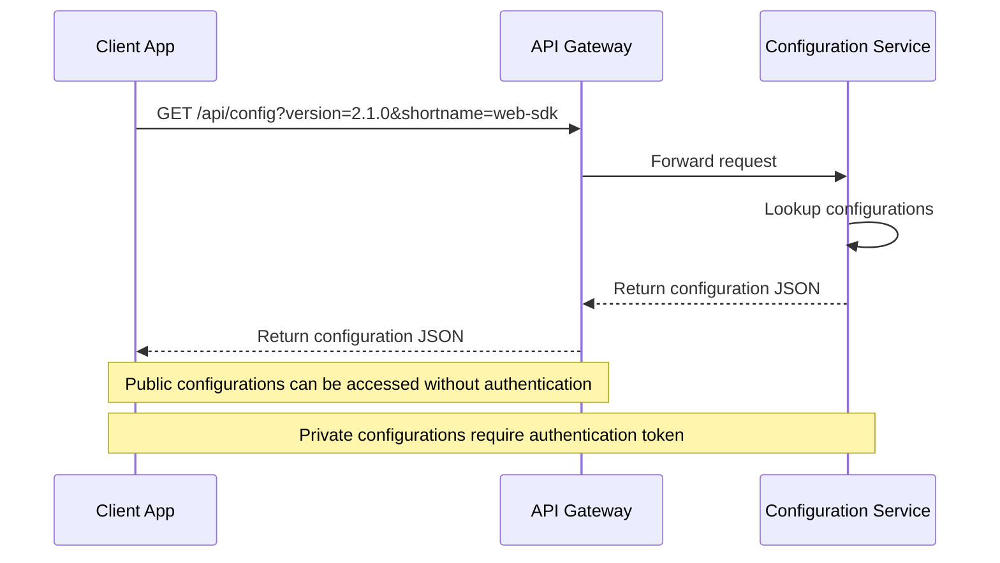
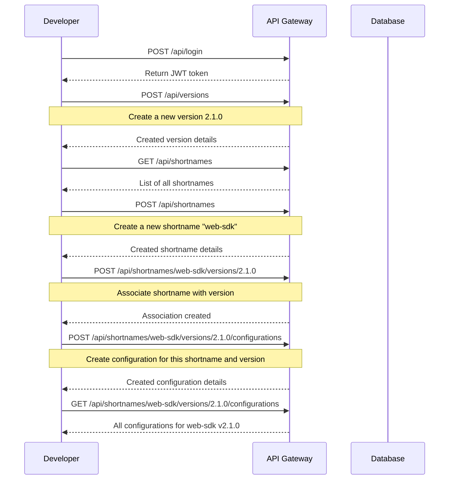

# WebCore Configuration Management System

A modern web application for managing configurations across different versions and shortnames.

## 📋 Overview

The WebCore Configuration Management System is a React-based web application that allows users to manage configurations for different versions of web components. It provides a user-friendly interface for creating, updating, and deleting versions, shortnames, and configurations.

### Key Features

- **Version-First Approach**: Create versions and manage shortnames within them
- **Configuration Management**: Add, edit, and delete configurations for each shortname
- **Version Duplication**: Easily duplicate versions with all their shortnames and configurations
- **Responsive Design**: Works on desktop and mobile devices

## 🔄 System Workflow

### Implementation Note

This system uses a hybrid approach where the frontend presents a version-first UI but interacts with a backend that uses a shortname-first API structure. This approach allows for a better user experience while maintaining compatibility with the existing backend.

**Current Implementation:**
- Versions are presented as top-level entities in the UI
- Behind the scenes, each version is associated with at least one shortname
- When creating a version, a default shortname with the same name is automatically created
- When retrieving all versions, the system aggregates versions across all shortnames

**Future Backend Updates:**
The backend will eventually be updated to support true version-first endpoints that match the frontend design.

### Frontend and Backend Interaction



### Configuration Retrieval Flow



### Version Management System



## 🏗️ Architecture

### Frontend Architecture

```
src/
├── components/       # UI components
├── contexts/         # React contexts for state management
├── pages/            # Page components
├── services/         # API services
├── types/            # TypeScript type definitions
└── App.tsx           # Main application component
```

### Backend Architecture

The application communicates with a serverless backend built on AWS Lambda and API Gateway. The backend provides RESTful APIs for managing versions, shortnames, and configurations.

```
lambda/
├── configuration_lambda/  # Lambda function for configuration management
├── login_lambda/          # Lambda function for authentication
├── register_lambda/       # Lambda function for user registration
├── shortname_lambda/      # Lambda function for shortname management
└── version_lambda/        # Lambda function for version management
```

## 🚀 Getting Started

### Prerequisites

- Node.js (v14 or later)
- npm or yarn

### Installation

1. Clone the repository:
   ```bash
   git clone https://github.com/your-username/webcore-idnow-configuration.git
   cd webcore-idnow-configuration
   ```

2. Install dependencies:
   ```bash
   npm install
   # or
   yarn install
   ```

3. Start the development server:
   ```bash
   npm start
   # or
   yarn start
   ```

4. Open [http://localhost:3000](http://localhost:3000) in your browser.

## 🔄 Data Flow

### Authentication Flow

1. User enters credentials on the login page
2. AuthContext handles authentication with the backend
3. On successful login, user is redirected to the dashboard
4. Protected routes ensure only authenticated users can access the application

### Version Management Flow

1. User creates a version (optionally duplicating from an existing version)
2. User adds shortnames to the version (a version can be associated with multiple shortnames)
3. User adds configurations to each shortname within that version
4. Each shortname has its own set of configurations that can be retrieved

> **Important**: A version is different from a shortname. You first create a version, then create shortnames for that version. Each shortname has its own set of configurations that can be retrieved.

### Configuration Retrieval Workflow



## 💼 Use Cases and Examples

### Case 1: Developer Working on a Feature



**Example:**

1. Developer Sarah is working on ticket SPX-300 for a new feature
2. She needs specific configurations for version 2.1.0
3. She retrieves the configurations using:
   ```bash
   curl -X GET "https://api.example.com/api/shortnames/web-sdk/versions/2.1.0/configurations" \
     -H "Authorization: Bearer ${TOKEN}"
   ```
4. She applies these configurations to her local development environment
5. The feature is developed consistently with the expected configuration

### Case 2: QA Testing Across Versions



**Example:**

1. QA Tester Mike needs to verify a feature works across multiple versions
2. He retrieves configurations for both version 2.0.0 and 2.1.0
3. He tests the application with each configuration set
4. He documents any differences in behavior caused by configuration changes

### Case 3: Product Manager Reviewing Features



**Example:**

1. Product Manager Lisa is planning features for the next release
2. She reviews the current configurations for version 2.1.0
3. She creates a new version 2.2.0 by duplicating 2.1.0
4. She modifies specific configurations to enable new features
5. The development team can now work with these configurations

## 🔌 Integration Examples

### Frontend Application Integration

```javascript
// Example React hook for fetching configurations
function useConfigurations(shortname, version) {
  const [configs, setConfigs] = useState([]);
  const [loading, setLoading] = useState(true);
  const [error, setError] = useState(null);
  
  useEffect(() => {
    async function fetchConfigurations() {
      try {
        setLoading(true);
        const response = await fetch(
          `${API_BASE_URL}/shortnames/${shortname}/versions/${version}/configurations`,
          {
            headers: {
              'Authorization': `Bearer ${localStorage.getItem('token')}`
            }
          }
        );
        
        if (!response.ok) {
          throw new Error('Failed to fetch configurations');
        }
        
        const data = await response.json();
        setConfigs(data.configurations);
      } catch (err) {
        setError(err.message);
      } finally {
        setLoading(false);
      }
    }
    
    fetchConfigurations();
  }, [shortname, version]);
  
  return { configs, loading, error };
}

// Usage in a component
function FeatureComponent() {
  const { configs, loading, error } = useConfigurations('web-sdk', '2.1.0');
  
  if (loading) return <div>Loading configurations...</div>;
  if (error) return <div>Error: {error}</div>;
  
  // Find a specific configuration
  const featureEnabled = configs.find(c => c.key === 'feature.enabled')?.value || false;
  
  return (
    <div>
      {featureEnabled ? (
        <div>Feature is enabled!</div>
      ) : (
        <div>Feature is disabled.</div>
      )}
    </div>
  );
}
```

### Backend Service Integration

```javascript
// Example Node.js service retrieving configurations
const axios = require('axios');

async function getConfigurations(shortname, version, token) {
  try {
    const response = await axios.get(
      `${process.env.API_BASE_URL}/shortnames/${shortname}/versions/${version}/configurations`,
      {
        headers: {
          'Authorization': `Bearer ${token}`
        }
      }
    );
    
    return response.data.configurations;
  } catch (error) {
    console.error('Failed to fetch configurations:', error);
    throw error;
  }
}

// Example usage in an Express route
app.get('/api/feature-status', async (req, res) => {
  try {
    const { shortname, version } = req.query;
    const token = req.headers.authorization.split(' ')[1];
    
    const configs = await getConfigurations(shortname, version, token);
    const featureConfig = configs.find(c => c.key === 'feature.enabled');
    
    res.json({
      featureEnabled: featureConfig ? featureConfig.value : false
    });
  } catch (error) {
    res.status(500).json({ error: 'Failed to get feature status' });
  }
});
```

### URL-Based Configuration Retrieval



**Example URL for retrieving configurations:**
```
https://api.example.com/api/shortnames/web-sdk/versions/2.1.0/configurations
```

**Response:**
```json
{
  "configurations": [
    {
      "configId": "conf-123",
      "key": "feature.enabled",
      "value": true,
      "description": "Toggle for new feature",
      "shortname": "web-sdk",
      "version": "2.1.0"
    },
    {
      "configId": "conf-124",
      "key": "api.endpoint",
      "value": "https://api.production.example.com/v2",
      "description": "API endpoint for the service",
      "shortname": "web-sdk",
      "version": "2.1.0"
    }
  ]
}
```

## 📝 API Documentation

### Authentication API

- `POST /api/login`: Authenticate user
- `POST /api/register`: Register new user

### Versions API

- `GET /api/shortnames/{shortname}/versions`: Get all versions for a shortname
- `GET /api/shortnames/{shortname}/versions/{version}`: Get a specific version
- `POST /api/shortnames/{shortname}/versions`: Create a new version
- `PUT /api/shortnames/{shortname}/versions/{version}`: Update a version
- `DELETE /api/shortnames/{shortname}/versions/{version}`: Delete a version

### Shortnames API

- `GET /api/shortnames`: Get all shortnames
- `GET /api/shortnames/{shortname}`: Get a specific shortname
- `POST /api/shortnames`: Create a new shortname
- `PUT /api/shortnames/{shortname}`: Update a shortname
- `DELETE /api/shortnames/{shortname}`: Delete a shortname

### Configurations API

- `GET /api/shortnames/{shortname}/versions/{version}/configurations`: Get all configurations
- `GET /api/shortnames/{shortname}/versions/{version}/configurations/{configId}`: Get a specific configuration
- `POST /api/shortnames/{shortname}/versions/{version}/configurations`: Create a new configuration
- `PUT /api/shortnames/{shortname}/versions/{version}/configurations/{configId}`: Update a configuration
- `DELETE /api/shortnames/{shortname}/versions/{version}/configurations/{configId}`: Delete a configuration

### API Usage Examples



### Typical Workflow Example

1. Create a version:
```bash
curl -X POST "https://api.example.com/api/versions" \
  -H "Authorization: Bearer YOUR_TOKEN_HERE" \
  -H "Content-Type: application/json" \
  -d '{
    "version": "2.1.0",
    "description": "New feature release",
    "isActive": true
  }'
```

2. Create a shortname:
```bash
curl -X POST "https://api.example.com/api/shortnames" \
  -H "Authorization: Bearer YOUR_TOKEN_HERE" \
  -H "Content-Type: application/json" \
  -d '{
    "shortname": "web-sdk",
    "description": "Web SDK configurations"
  }'
```

3. Associate the shortname with the version:
```bash
curl -X POST "https://api.example.com/api/shortnames/web-sdk/versions" \
  -H "Authorization: Bearer YOUR_TOKEN_HERE" \
  -H "Content-Type: application/json" \
  -d '{
    "version": "2.1.0",
    "description": "Version 2.1.0 for web-sdk",
    "isActive": true
  }'
```

4. Create configurations for this shortname and version:
```bash
curl -X POST "https://api.example.com/api/shortnames/web-sdk/versions/2.1.0/configurations" \
  -H "Authorization: Bearer YOUR_TOKEN_HERE" \
  -H "Content-Type: application/json" \
  -d '{
    "key": "feature.enabled",
    "value": true,
    "description": "Toggle for new feature"
  }'
```

### Curl Command Examples

For detailed curl command examples, see the [curl-examples.txt](./curl-examples.txt) file.

Example of retrieving configurations for a specific version:

```bash
curl -X GET "https://api.example.com/api/shortnames/web-sdk/versions/2.1.0/configurations" \
  -H "Authorization: Bearer YOUR_TOKEN_HERE" \
  -H "Content-Type: application/json"
```

## 🧩 Component Documentation

### AuthContext

The `AuthContext` provides authentication state and functions throughout the application:

```jsx
const { authState, login, register, logout, clearError } = useAuth();
```

- `authState`: Contains authentication state (isAuthenticated, user, loading, error)
- `login`: Function to authenticate user
- `register`: Function to register new user
- `logout`: Function to log out user
- `clearError`: Function to clear authentication errors

### Layout Component

The `Layout` component provides the main layout structure with a responsive sidebar:

```jsx
<Layout>
  <YourContent />
</Layout>
```

### ProtectedRoute Component

The `ProtectedRoute` component ensures that only authenticated users can access protected routes:

```jsx
<ProtectedRoute>
  <YourProtectedComponent />
</ProtectedRoute>
```

## 🔧 Development

### Code Style

This project uses ESLint and Prettier for code formatting and linting:

```bash
# Run linter
npm run lint

# Fix linting issues
npm run lint:fix
```

### Building for Production

```bash
npm run build
# or
yarn build
```

## 📚 Best Practices

### State Management

- Use React Context for global state
- Use local state for component-specific state
- Use custom hooks for reusable state logic

### Component Structure

- Keep components small and focused
- Use composition over inheritance
- Extract reusable logic into custom hooks

### API Calls

- Use the service layer for all API calls
- Handle loading and error states
- Use proper error handling

## 🤝 Contributing

1. Fork the repository
2. Create a feature branch: `git checkout -b feature/your-feature-name`
3. Commit your changes: `git commit -m 'Add some feature'`
4. Push to the branch: `git push origin feature/your-feature-name`
5. Open a pull request

## 📄 License

This project is licensed under the MIT License - see the LICENSE file for details.
